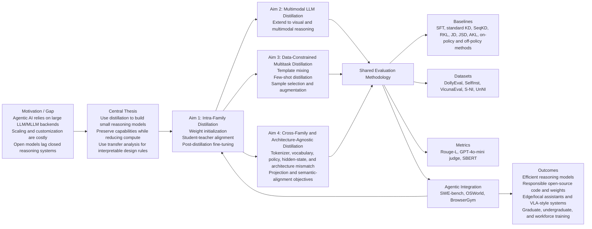

# Proposal Logic Flow: Self-Training Small Reasoning Models

Source PDF: `draft-1.pdf`

## Reading Of The Proposal Logic

The proposal starts from the practical constraint that modern agents depend on large model backends that are expensive to train, modify, and deploy. The central response is to study distillation as a way to transfer reasoning ability into smaller models while also learning which mechanisms make that transfer work.

The research plan builds outward from a controlled case. Aim 1 studies intra-family distillation where teacher and student are closely related. Later aims relax that assumption: first to multimodal models, then to multitask settings with uneven data, then to cross-family and architecture-agnostic transfer where tokenizers, vocabularies, policies, and representations may not align.

The evaluation plan is shared across the aims and closes the loop. Standard language-generation benchmarks and metrics test model quality, while agentic benchmarks test whether the distilled models actually work inside harnesses. Failures from those agent evaluations are meant to feed the next iteration of distillation method design.
